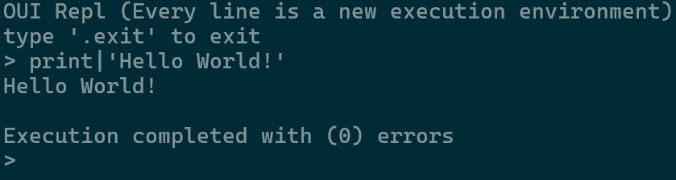

# OUI
OUI is an esolang which is friendly!
 
## What OUI offers?
*	**Errors are not fatal**, anyone one can make mistakes. The Program doesn’t stop when an error occurs.
*	**All Numbers are floats**, think floats as better int
*	**Good booleans**, Bools can be 'true', 'TT', 'false', 'FF'
*	**Flexible names**, Operation (function)/Variable names can include spaces or some special characters

## More About OUI
*	Strings must be start and end with single quote
*	OUI doesn't have super cow powers.

## How Can I Run?
First. download the source code with following command.
```bash
git clone https://github.com/kerem3338/oui
```
then run OUI Interpreter with following command
```bash
python oui.py
```
#### With that you get *OUI REPL*


### The Syntax
OUI just has operations (functions) to work with, so function calls are seperated by a `---` and function arguments are seperated by a `\`
**Example:**
```text
print|'Hello World' --- normal exit
```

*Note: OUI has syntax highlighting for Sublime Text in [extras](./extras) folder.*